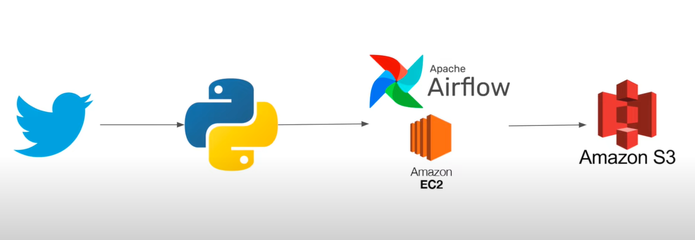

# 🐦 Twitter Data Pipeline with Apache Airflow and AWS

This project demonstrates how to build an end-to-end data pipeline to extract tweets using the Twitter API, transform the data using Python, orchestrate the pipeline using Apache Airflow on an EC2 instance, and store the results in Amazon S3.


---

## 🚀 Tech Stack

- **Twitter API** – Data source
- **Python + Pandas** – Data extraction and transformation
- **Tweepy** – Python wrapper for Twitter API
- **Apache Airflow** – Pipeline orchestration
- **Amazon EC2** – Hosting Airflow server
- **Amazon S3** – Data storage

---

## 🔧 Setup Instructions

### 1. Twitter Developer Setup
- Create a [Twitter Developer Account](https://developer.twitter.com/en/portal/dashboard)
- Generate and store:
  - API Key & Secret
  - Bearer Token
  - Access Token & Secret

### 2. Install Dependencies (on EC2 or locally)
```bash
sudo apt-get update
sudo apt install python3-pip
sudo pip install apache-airflow pandas s3fs tweepy
```

### 3. Sample Tweet Extraction Script
```bash
import tweepy
client = tweepy.Client(bearer_token=BEARER_TOKEN)
query = "from:elonmusk -is:retweet"
tweets = client.search_recent_tweets(query=query, max_results=10)
for tweet in tweets.data:
    print(tweet.text)
```
### ☁️ Deploying Airflow on EC2
1. Launch EC2 Instance
OS: Ubuntu, Type: t2.micro

Add Inbound Rule to allow TCP traffic on port 8080

2. SSH and Start Airflow
```bash
ssh -i "your-key.pem" ubuntu@<EC2_PUBLIC_DNS>
airflow standalone
```
Access Airflow UI: http://<EC2_PUBLIC_DNS>:8080

### 📈 Airflow DAG Setup
Example Task Definition
```bash
def extract_transform():
    # Extract tweets and save to S3
    pass

PythonOperator(
    task_id='complete_twitter_etl',
    python_callable=extract_transform,
    dag=dag
)
```

📦 Save to S3
1. Create a bucket (e.g., twitter-data-bucket)
2. Save dataframe:
```bash
df.to_csv("s3://twitter-data-bucket/elon_tweets.csv")
```
3. IAM Role must include AmazonS3FullAccess

### ✅ Final Output
Extracted tweets from Twitter API
CSV saved in Amazon S3
DAG orchestrated via Airflow running on EC2


✨ Built as a practice project to learn orchestration, API integration, and cloud-based data pipelines.

Let me know if you'd like this exported to a file or need help with your `dag.py` code section!

